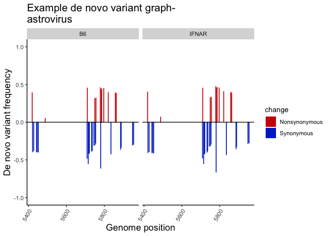

Dirty mouse virome-code for transmission bottleneck and de novo variant graphs
================
Frances Shepherd
1/27/2021

``` r
#Import data: a csv file containing the average frequencies of astrovirus rdrdp amplicon variants detected by the ivar pipeline. These frequencies are determined by comparing a pet store mouse to itself (i.e. an "intra-pet store mouse variant"), and each of the specific pathogen free (SPF) mouse genotypes (i.e. B6, IFNAR knockout, IFNLR knockout, or IFNLAR knocout) to the petstore mice. 
library(ggplot2)
library(RColorBrewer)
library(dplyr)

dat <- read.csv("../analysis/transmission_bottlenecks/variant_calling/example_astrovirus_combined_filtered_variants.csv", header=TRUE, stringsAsFactors = FALSE) %>% #<- user set filename
  mutate(mouse_genotype = as.factor(mouse_genotype)) %>%
  subset(., PASS_repA == "TRUE" & PASS_repB == "TRUE" & exclude_from_final != "Y") %>% #Filter out observations with non-significant Fisher's exact tests, and those that fall within primer binding sites/outside of assembled consensus region.
  .[!grepl("[-\\+]", .$ALT), ] %>% #remove insertions or deletions from consideration
  .[,c("experiment", "primer_set", "mouse_ivar_number", "cage", "mouse_genotype", "REGION", "POS", "REF", "ALT", "REF_CODON", "REF_AA", "ALT_CODON", "ALT_AA", "average_variant_freq")] #pare down dataset


#separate the data into two separate dataframes, one containing the intra-petstore mouse variants, and one containing the SPF vs pet store mouse variants
petstore.variants <- dat[grep("petstore", dat$mouse_genotype), ]
spf.variants <- dat[-grep("petstore", dat$mouse_genotype), ]

merged<- merge(x=spf.variants, y=petstore.variants, by = c("experiment", "primer_set", "POS", "REF", "ALT", "cage", "REGION"), all.x = TRUE, all.y = TRUE, suffixes = c("_spf", "_petstore"))

#Replace NA's in the variant frequency columns with zeros so that the frequencies of variants can be graphed
merged[,c("average_variant_freq_spf", "average_variant_freq_petstore")][is.na(merged[,c("average_variant_freq_spf", "average_variant_freq_petstore")])] <- 0

#Make the mouse genotypes into character type
merged$mouse_genotype_spf <- as.character(merged$mouse_genotype_spf)

#Replace NA's in the "Reference_spf" column to "untransmitted" to allow for graphing
merged[,"mouse_genotype_spf"][is.na(merged[,"mouse_genotype_spf"])] <- "untransmitted"

#Turn mouse genotypes back to factor type
merged$mouse_genotype_spf <- as.factor(merged$mouse_genotype_spf)

#Rename mouse genotypes for the graph legend
levels(merged$mouse_genotype_spf) <- list("B6"="b6_cohoused",
                                         "IFNAR" = "IFNAR_ko_cohoused",
                                         "IFNLR" = "IFNLR_ko_cohoused",
                                         "IFNLAR" = "IFNLAR_ko_cohoused",
                                         "Untransmitted" = "untransmitted")
```

### Plot of bottleneck analysis

``` r
combined.plot <- ggplot(merged, aes(y=average_variant_freq_spf, x=average_variant_freq_petstore))+
  geom_point(aes(color = mouse_genotype_spf),
             size = 2)+
  scale_color_brewer(palette = "Set1")+
  labs(color = "Mouse genotype")+
  scale_x_continuous(limits = c(0, 1), name="Reservoir (pet store mouse) Frequency") +
  scale_y_continuous(limits = c(0, 1), name="Host Frequency") +
  ggtitle("Example transmission bottleneck graph-\nastrovirus")+
  theme(panel.grid = element_blank(),
        panel.background = element_blank(),
        axis.line = element_line(colour = "black"),
        legend.key = element_blank(),
        plot.title = element_text(size = 16),
        axis.title = element_text(size = 14),
        axis.text.y = element_text(size = 12),
        axis.text.x = element_text(size = 12, angle = 45, hjust = 1),
        legend.title = element_text(size = 14),
        legend.text = element_text(size = 14),
        strip.text = element_text(size = 16),
        aspect.ratio = 1)
combined.plot
```


### Denovo variant analyses

``` r
#Modify dataframe to include information about synonymous and nonsynonymous nucleotide changes
denovo.variants.df <- merged %>%
  mutate(change = ifelse(REF_AA_spf == ALT_AA_spf, "S", "N")) %>% #Add new variable that compares reference and alternate amino acid, assigns "S" for synonymous change (same amino acid identity), "N" for nonsynonymous change (different aa identity)
  mutate(average_variant_freq_spf = ifelse(change == "N", average_variant_freq_spf, -average_variant_freq_spf)) #Change frequency of nonsynonymous changes to negative number, so it graphs below the line, for better visualization

denovo.variants <- ggplot(data = subset(denovo.variants.df, average_variant_freq_petstore == 0),
                          aes(x=POS, 
                              y = average_variant_freq_spf,
                              fill = change,
                              color = change)) +
  geom_bar(stat = "identity", position = "dodge") +
  geom_hline(yintercept = 0)+
  facet_grid(.~mouse_genotype_spf)+
  scale_color_manual(values = c("#CC0000", "#0033CC"), guide="none")+
  scale_fill_manual(values = c("#CC0000", "#0033CC"), labels=c("Nonsynonymous", "Synonymous"))+
  scale_y_continuous(limits = c(-1,1), name="De novo variant frequency") +
  scale_x_continuous(name = "Genome position") +
  ggtitle("Example de novo variant graph-\nastrovirus") +
  theme(panel.grid = element_blank(),
        panel.background = element_blank(),
        axis.line = element_line(colour = "black"),
        legend.key = element_blank(),
        axis.title = element_text(size = 14),
        axis.text.x = element_text(angle = 60, hjust=1),
        plot.title = element_text(size=16))

denovo.variants
```


